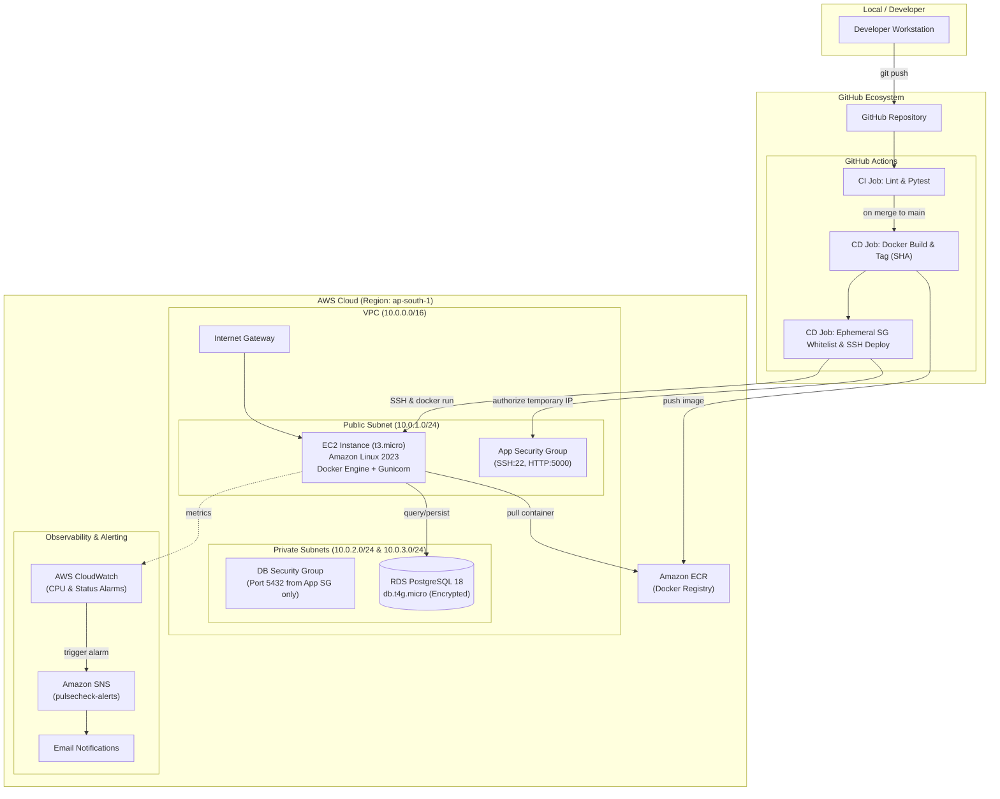

# PulseCheck 🩺

> An automated, production-grade HTTP uptime monitoring dashboard built with Python (Flask), containerized with Docker, provisioned on AWS via Terraform, and continuously deployed with GitHub Actions and CloudWatch alerting.

[](https://www.python.org/)
[](https://flask.palletsprojects.com/)
[](https://www.docker.com/)
[](https://www.terraform.io/)
[](https://aws.amazon.com/)
[](https://www.postgresql.org/)
[](https://github.com/features/actions)

---

## 📌 Overview

**PulseCheck** monitors website availability and HTTP response latencies at scheduled intervals. It calculates rolling 24-hour uptime percentages, records complete check histories, and alerts on downtime.

Designed as an end-to-end cloud and DevOps demonstration, PulseCheck showcases **Infrastructure as Code (IaC)**, **secure network topology**, **automated CI/CD pipelines**, and **cloud observability**, adhering to AWS Free Tier constraints and industry security best practices.

---

## 🏛️ System Architecture



---

## 🛠️ Technology Stack

| Layer | Technologies & Services |
|---|---|
| **Application Layer** | Python 3.12, Flask, SQLAlchemy, Alembic (Flask-Migrate), APScheduler, Requests, Gunicorn |
| **Containerization** | Docker, Docker Compose, Multi-stage builds |
| **Infrastructure as Code** | Terraform (`>= 1.16`), AWS Provider (`~> 6.0`) |
| **Compute & Network** | AWS VPC, Public & Private Subnets, Internet Gateway, EC2 (`t3.micro`), Security Groups |
| **Database** | AWS RDS PostgreSQL 18 (`db.t4g.micro`), encrypted storage with automatic subnet groups |
| **Container Registry** | AWS Elastic Container Registry (ECR) |
| **CI/CD Pipeline** | GitHub Actions (automated linting, testing, image packaging, zero-trust deployment) |
| **Monitoring & Alerting**| AWS CloudWatch (Metric Alarms), Amazon SNS, Email Subscription |

---

## 📂 Repository Structure

```
PulseCheck/
├── .github/
│   └── workflows/
│       ├── ci.yml              # CI: flake8 linting & pytest test suite
│       └── cd.yml              # CD: Build, ECR push, ephemeral SG ingress & EC2 deploy
├── app/
│   ├── __init__.py             # Flask application factory
│   ├── checker.py              # URL health-checking logic & metrics aggregation
│   ├── extensions.py           # SQLAlchemy & Alembic instances
│   ├── models.py               # MonitoredUrl and CheckResult database schemas
│   ├── routes.py               # Dashboard and REST API endpoints
│   ├── scheduler.py            # APScheduler background runner
│   └── templates/
│       ├── dashboard.html      # Main status dashboard UI
│       └── url_history.html    # Detailed latency & check history per URL
├── docker/
│   └── entrypoint.sh           # DB migration execution & Gunicorn server launch
├── migrations/                 # Alembic database schema migrations
├── terraform/
│   ├── cloudwatch.tf           # CloudWatch CPU alarms, status check alarms & SNS topic
│   ├── ec2.tf                  # EC2 instance, IAM instance profile & Docker user-data
│   ├── ecr.tf                  # ECR container repository
│   ├── outputs.tf              # IPs, endpoints, and ARNs
│   ├── providers.tf            # AWS provider configuration
│   ├── rds.tf                  # PostgreSQL RDS database instance
│   ├── security_groups.tf      # EC2 and RDS firewall rules
│   ├── terraform.tfvars.example# Template for environment variables
│   ├── variables.tf            # Variable declarations
│   └── vpc.tf                  # VPC, subnets, IGW, and routing tables
├── tests/
│   ├── conftest.py             # Pytest fixtures and test database setup
│   ├── test_checker.py         # Unit tests for URL pinging & timeouts
│   ├── test_history.py         # History query & uptime calculation tests
│   └── test_routes.py          # Flask route integration tests
├── .env.example                # Example environment configuration
├── .gitignore                  # Git ignore rules (secrets, state, cache)
├── docker-compose.yml          # Local multi-container development environment
├── Dockerfile                  # Production container definition
├── requirements.txt            # Python dependencies
└── wsgi.py                     # Production WSGI entry point
```

---

## 🚀 Getting Started

### 1. Local Development (Docker Compose)

Run the full application and database locally on your machine:

1. **Clone the repository:**
   ```bash
   git clone https://github.com/avipednekar/Pulse-Check.git
   cd Pulse-Check
   ```

2. **Configure environment:**
   ```bash
   cp .env.example .env
   # Update SECRET_KEY or keep default local development values
   ```

3. **Start services:**
   ```bash
   docker compose up --build
   ```

4. **Access the dashboard:**
   Open your browser at `http://localhost:5000`.

---

### 2. Running Unit & Integration Tests

Run the test suite locally in an isolated virtual environment:

```bash
# Create and activate virtual environment
python -m venv .venv
source .venv/bin/activate       # On Linux/macOS
# .venv\Scripts\Activate.ps1   # On Windows

# Install dependencies
pip install -r requirements.txt
pip install flake8 pytest

# Run linting
flake8 app/ tests/ --max-line-length=120

# Run tests
PYTHONPATH=. pytest tests/ -v
```

---

## ☁️ Cloud Infrastructure (Terraform)

All AWS infrastructure is managed as code using Terraform under `terraform/`.

### Infrastructure Provisioning Steps

1. **Configure AWS CLI:**
   Ensure your local environment has AWS credentials configured with the necessary IAM permissions:
   ```bash
   aws configure
   ```

2. **Prepare Terraform variables:**
   ```bash
   cd terraform
   cp terraform.tfvars.example terraform.tfvars
   ```
   Edit `terraform.tfvars`:
   ```hcl
   aws_region   = "ap-south-1"
   project_name = "PulseCheck"
   my_ip        = "YOUR_PUBLIC_IP/32"   # Scopes SSH and web port to your IP
   db_username  = "postgresadmin"
   db_password  = "YourSecurePassword123"
   alert_email  = "your-email@example.com" # Optional: For CloudWatch SNS alerts
   ```

3. **Initialize and Apply:**
   ```bash
   terraform init
   terraform plan
   terraform apply
   ```

4. **Verify Outputs:**
   Terraform will display your EC2 public IP, RDS endpoint, ECR URL, and SNS Topic ARN.

---

## 🔄 CI/CD Pipeline

The repository features an automated continuous integration and continuous deployment pipeline using **GitHub Actions**.

### Pipeline Stages

1. **Continuous Integration (`ci.yml`)**:
   - Triggers on every push or pull request to `main`.
   - Lints code using `flake8` for PEP8 compliance.
   - Executes the automated test suite with `pytest`.
   - Enforces a quality gate: failing tests halt the pipeline immediately.

2. **Continuous Deployment (`cd.yml`)**:
   - Triggers on successful merge to `main`.
   - **Build & Package**: Builds the Docker container, generates an immutable image tag from the Git commit SHA (`${GITHUB_SHA::7}`), and pushes both `:<sha>` and `:latest` to Amazon ECR.
   - **Ephemeral Ingress Whitelisting**:
     - Dynamically discovers the GitHub runner's public IP (`checkip.amazonaws.com`).
     - Adds a temporary `/32` authorization rule to the EC2 security group for port 22.
   - **Zero-Downtime Deployment**:
     - Connects to the EC2 instance via SSH.
     - Pulls the newest image from ECR.
     - Gracefully swaps the running container with updated configurations.
   - **Ingress Revocation**:
     - Executes `aws ec2 revoke-security-group-ingress` inside an `if: always()` block, guaranteeing SSH access is sealed even if deployment steps fail.

### Required GitHub Secrets

To configure the deployment workflow in your own repository, set the following under **Settings > Secrets and variables > Actions**:

| Secret Name | Description |
|---|---|
| `AWS_ACCESS_KEY_ID` | IAM Access Key for deployment user |
| `AWS_SECRET_ACCESS_KEY` | IAM Secret Key for deployment user |
| `AWS_ACCOUNT_ID` | AWS 12-digit Account Number |
| `APP_SG_ID` | Application Security Group ID (`sg-...`) |
| `EC2_SSH_PRIVATE_KEY` | OpenSSH private key matching `pulsecheck-key` |
| `DATABASE_URL` | SQLAlchemy PostgreSQL connection URI |
| `SECRET_KEY` | Production cryptographic session key |

---

## 📊 CloudWatch Monitoring & Alerting

PulseCheck provisions proactive monitoring directly through Terraform:

- **EC2 High CPU Alarm (`pulsecheck-ec2-cpu-high`)**:
  - Triggers if average CPU utilization exceeds **80%** across two consecutive 5-minute intervals.
  - Prevents alert fatigue from momentary spikes while quickly catching sustained runaway loops.
- **EC2 Status Check Alarm (`pulsecheck-ec2-status-check-failed`)**:
  - Monitors underlying hardware and OS hypervisor health (`StatusCheckFailed > 0` for 2 minutes).
- **Amazon SNS Integration**:
  - Automatically publishes alerts and recovery (`OK`) notifications to the `pulsecheck-alerts` topic, dispatching real-time emails to subscribed engineers.

---

## 🛡️ DevOps & Security Design Highlights

- **Principle of Least Privilege**: The deployment IAM user and EC2 IAM instance profiles contain strictly scoped policies (e.g., ECR Read-Only on the host instance).
- **Network Isolation**: The PostgreSQL RDS instance is isolated inside private VPC subnets with no internet gateway route, accepting ingress exclusively on port 5432 from the application security group.
- **Ephemeral Firewalls in CI/CD**: Avoids the dangerous anti-pattern of opening SSH (port 22) to `0.0.0.0/0` by using dynamic runner IP authorization and guaranteed cleanup.
- **Immutable Artifacts**: Every Docker build is tagged with the exact 7-character Git commit SHA, providing complete auditability and instant rollback capabilities.
- **Credential Hygiene**: Zero hardcoded secrets in the codebase; sensitive database credentials and tokens are loaded via environment variables and GitHub Secrets.

---

## 🧹 Infrastructure Teardown

To avoid unnecessary cloud costs and preserve AWS Free Tier limits when not demonstrating the project:

```bash
cd terraform
terraform destroy
```

---

## 📄 License

This project is open-source and available under the [MIT License](LICENSE).
